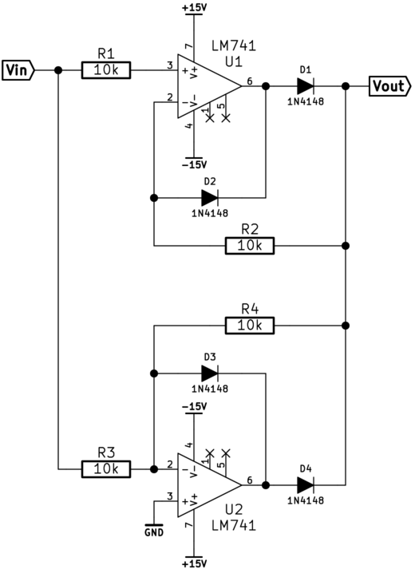

\newpage

Inverting DC Amplifier
======================

Theory
------

Gain, Av, can be expressed as a ratio of the feedback impedance to the input
impedance. A fraction of the output is fed back, causing the op amp to
compensate and in effect amplify.
\begin{equation}
A_v = \frac{R_2}{R_1}
\end{equation}

The circuit gain for ideal components is therefore;

For $R_2 = 100k\Omega$:

\begin{align} 
A_v     &= \frac{V_{out}}{V_{in}} = -\frac{R_2}{R_1}\\
        &= \frac{100k\Omega}{10k\Omega} = 10\\
        &= 20 \times \log{\frac{10}{1}} = 20dB  
\end{align}

For $R_2 = 10k\Omega$:

\begin{align} 
A_v     &= \frac{V_{out}}{V_{in}} = -\frac{R_2}{R_1}\\
        &= \frac{10k\Omega}{10k\Omega} = 10\\
        &= 20 \times \log{\frac{1}{1}} = 0dB  
\end{align}

In both cases, the signal phase is inverted $180^\circ$.

Measurements
------------

Uin (V)     Uout(V)     Av(x)
-------     -------     -----
-0.105      +1.087      -10.54
-1.008      +10.236     -10.15
+1.004      -10.104     -10.06

Table: R2 = 100kΩ

Uin (V)     Uout(V)     Av(x)
-------     -------     -----
-0.1051     +0.1051     -1
-1.008      +1.008      -1
+1.004      -1.004      -1

Table: R2 = 10kΩ

Inverting AC Amplifier
======================

Oscilloscope shots
------------------

Measurements
------------
Measured amplification  =   ---
Measured phase          =   180
Theoretical amplifier   =   
Theoretical phase       =   

Non-inverting DC Amplifier
==========================

Av = 1 + R2/R1

Measurements
------------

Uin (V)     Uout (V)     Av (ggr)
-------     --------     --------
+0.1007     +0.2164     2.15
+1.002      +2.048      2.04
-1.005      -2.03       2.019

Table: R2 = 10kΩ

Uin (V)     Uout (V)    Av (ggr)
-------     --------    --------
+0.1009     +1.178      11.67
+1.1013     +11.3       11.15
-1.004      -11.09      11.05

Table: R2 = 100kΩ

Non-inverting AC Amplifier
==========================

Measurements
------------
Input signal amplitude      =       
Output signal amplitude     =       
Measured amplification      =       
Measured phase              =

Theoretical amplification   =
Theoretical phase           =

Active full wave rectifier
==========================
Active rectifier does not suffer from the “deadzone” when the signal is too
small to turn on the rectifying diode. The op amp compensates for the diode
forward voltage drop. The circuit output is a full wave rectified version of
the signal, with a frequency limit mostly set by the op amp bandwidth. Diode D2
prevents the op amp from hitting the rail hard when D1 is reverse biased.  This
makes the recovery and rise time faster when D1 biases on.  This improves
circuit response times.

